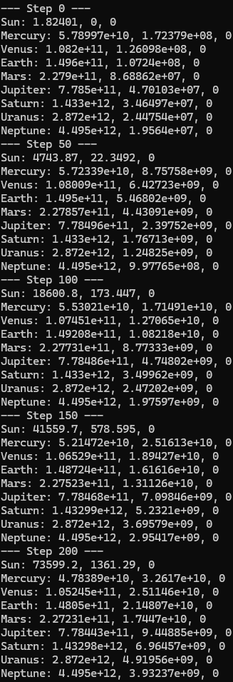

# Space Simulator

Space Simulator is a modular, extensible C++ application that simulates celestial mechanics and planetary systems using modern C++23. The project is designed for educational, research, and entertainment purposes, providing a foundation for realistic space simulations.

## Features

- **Physics Engine:**
	- N-body gravitational simulation using Newtonian physics
	- Velocity Verlet integration for stable and accurate motion
- **Simulation Core:**
	- Modular `SpaceObject` and `SimulationEngine` classes
	- Easily extendable to support new physics models
- **Graphics & Input (Stubbed):**
	- Renderer interface for future graphical output (Vulkan/SDL ready)
	- Input manager stub for user interaction (GLFW planned)
- **Unit Tests:**
	- GoogleTest-based tests for core simulation and physics
- **Modern C++:**
	- Written in C++23, with clean, portable code and strict warnings

## Project Structure

```
├── src/
│   ├── main.cpp                # Entry point: sets up solar system and runs simulation
│   ├── graphics/               # Renderer (stub)
│   ├── input/                  # Input manager (stub)
│   ├── physics/                # Gravity system, integrators
│   └── simulation/             # Simulation engine, space objects, math
├── include/                    # Public headers for all modules
├── tests/                      # GoogleTest unit tests
├── assets/                     # Models, textures (for future graphics)
├── CMakeLists.txt              # Top-level CMake build file
└── README.md                   # Project documentation
```

## Architecture

- **SimulationEngine:** Orchestrates the simulation loop, updating all space objects using the selected physics model and integrator.
- **SpaceObject:** Represents celestial bodies (planets, stars, etc.) with mass, position, velocity, and acceleration.
- **GravitySystem:** Calculates gravitational forces between all objects.
- **VelocityVerlet:** Integrates motion equations for stable time evolution.
- **Renderer/InputManager:** Stubs for future graphical and input support.

## Getting Started

### Prerequisites

- C++23 compatible compiler (MSVC, GCC, or Clang)
- [CMake 3.14+](https://cmake.org/)
- (Optional) GoogleTest for running unit tests (already included in `packages/`)

### Build Instructions

1. **Clone the repository:**
	 ```sh
	 git clone https://github.com/PedroGF45/space-simulator.git
	 cd space-simulator
	 ```
2. **Configure and build:**
	 ```sh
	 cmake -S . -B build
	 cmake --build build
	 ```
3. **Run the simulator:**
	 ```sh
	 ./build/SpaceSimulator
	 ```

### Running Tests

1. **Build tests:**
	 ```sh
	 cmake --build build --target space-simulator-test
	 ```
2. **Run tests:**
	 ```sh
	 ./build/tests/space-simulator-test
	 ```


## Simulation Example

Below is a visual representation of the simulation output, showing the interaction and movement of celestial objects in interstellar space:



## Usage

The default simulation models the Sun and several planets. You can extend `main.cpp` to add more objects or customize initial conditions.

## Contributing

Contributions are welcome! Please open issues or pull requests for bug fixes, new features, or improvements. For major changes, discuss them in an issue first.

## License

This project is licensed under the MIT License. See the `LICENSE` file for details.

---
*Space Simulator – Simulate the universe, one object at a time.*
